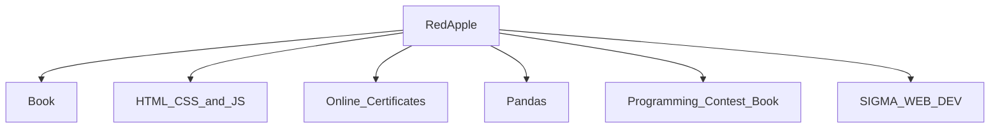

## Stack
Not a code project. No manifest (package.json, go.mod, pyproject.toml, Cargo.toml) exists at repo root or in any subfolder. The repo is a personal collection of PDFs, course notes, certificates, and standalone/unconnected code snippets (C++ competitive-programming solutions, a Python script, HTML/CSS/JS course files) with no build system, no shared runtime, and no inter-file dependencies observed.

## Directory map
| path | what lives there |
|---|---|
| `Book/` | Reference PDFs (networking, DBMS, OS, SQL, hacking, electronics) + `Book 2.pages` |
| `Book/Software Arc/` | Software Architecture course notes, subfolders `day 1`–`Day 6` |
| `HTML CSS and JS/` | HTML/CSS/JS learning resources |
| `HTML CSS and JS/.vscode/` | Editor config: `tsconfig.json`, `launch.json`, `tasks.json` |
| `Online Certificates/` | Course-completion certificates + `README.md` |
| `Online Certificates/CodeChef/` | `Codechef.pdf` |
| `Online Certificates/Cisco/` | `Cisco.pdf` |
| `Online Certificates/Hacker Rank/` | `C# (Hacker Rank).png` |
| `Pandas/` | Python Pandas learning materials |
| `Pandas/PandasApp/` | `test.py` |
| `Programming contest Book 00/` | Competitive-programming C++ snippets by topic |
| `Programming contest Book 00/TREE/`, `Number Theory/`, `Tecnique/`, `Bit Manupulations/` (and a duplicate `Bit Manupulations /` with trailing space), `Data Structure/`, `Graph/`, `STL/`, `Advance/`, `Searching and sorting/`, `Dynamic Programming/`, `Greedy Tecnique/` | Each holds standalone `.cpp` files for that algorithm/data-structure topic |
| `SIGMA WEB DEV/` | Sigma Web Dev course materials |
| `SIGMA WEB DEV/Day 1/` | `script.js`, `style.css` |
| `SIGMA WEB DEV/Day 2/` | `index.css` |

## Diagram

## Component index
- [[Book]]
- [[HTML_CSS_and_JS]]
- [[Online_Certificates]]
- [[Pandas]]
- [[Programming_Contest_Book]]
- [[SIGMA_WEB_DEV]]

## Entry points
- No dev or prod entry point exists — no manifest, no build script, no `main.*`/`index.*`/`app.*` at repo root. TODO: verify per-subfolder if any subproject is later added.

## Conventions
- Files use Title Case / mixed-case names with spaces, e.g. `Number Theory/BigMod.cpp`, `Book/Operating System Notes.pdf` (observed throughout the tree).
- One folder per topic under `Programming contest Book 00/`, each holding independent `.cpp` files named after the technique they implement (observed).
- Duplicate folder exists: `Programming contest Book 00/Bit Manupulations/` and `Programming contest Book 00/Bit Manupulations /` (trailing space) both present in the tree — not consolidated.
- `README.md` present at repo root and inside `Online Certificates/`, each describing only its own folder's contents (observed).

## Where things go
- To add a new reference PDF/book, add the file under `Book/`.
- To add a new competitive-programming snippet, add a `.cpp` file to the matching topic folder under `Programming contest Book 00/`, or create a new topic folder there if none fits.
- To add a new course-completion certificate, add it under `Online Certificates/<Platform>/`.
- To add new web-dev coursework, add files under `SIGMA WEB DEV/Day <n>/` (create a new `Day <n>/` folder for a new day).
- To add new Pandas exercises, add files under `Pandas/PandasApp/`.
